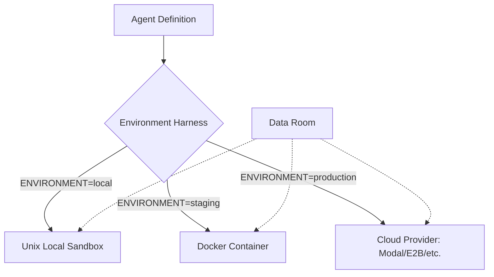

# AI Agents Harness

> **A robust, multi-environment sandbox harness for OpenAI Agents.**

[](https://www.python.org/downloads/)
[](https://openai.com/index/the-next-evolution-of-the-agents-sdk/)
[](https://opensource.org/licenses/MIT)

This repository provides a unified architecture for developing, testing, and deploying AI agents with isolated code execution capabilities. The **Harness Architecture** decouples agent business logic from infrastructure, enabling transitions from local development to production-style environments.

It now includes two complementary tracks:

- `openai-agents-harness/`: OpenAI Agents SDK sandbox examples.
- `harness-engineering/`: framework-neutral Harness Engineering patterns for running, evaluating, tracing, and comparing agents across frameworks.

---

## Key Features

- **Multi-Environment Support**: Swap execution backends (Unix-local, Docker, Modal, etc.) using simple environment variables.
- **Decoupled Architecture**: Write your agent definition once; run it across supported sandbox clients without modifying the core logic.
- **Sandboxed Execution Options**: Run locally for fast iteration, or use Docker and hosted providers when you need stronger isolation boundaries.
- **Rich Provider Ecosystem**: Built-in examples for sandbox providers including Daytona, E2B, Modal, Cloudflare, Vercel, Blaxel, and Runloop.
- **Data Mounting**: Map local directories and datarooms into the agent's execution context.

---

## Architecture Overview

The core philosophy of this harness is to treat the **Sandbox Provider** as a swappable configuration rather than a hardcoded implementation detail.


```mermaid
graph TD
    A[Agent Definition] --> B{Environment Harness}
    B -- ENVIRONMENT=local --> C[Unix Local Sandbox]
    B -- ENVIRONMENT=staging --> D[Docker Container]
    B -- ENVIRONMENT=production --> E[Cloud Provider: Modal/E2B/etc.]

    F[Data Room] -.-> C
    F[Data Room] -.-> D
    F[Data Room] -.-> E
```

---

## Project Structure

```text
ai-agents-harness/
|-- openai-agents-harness/  # Implementation & examples
|   |-- 01_... to 05_...    # Feature-specific demonstrations
|   |-- 06_multi_environment.py
|   `-- 07_sandbox_providers/
|-- harness-engineering/    # Framework-neutral harness contracts and adapter sketches
|-- dataroom/               # Local data directory for mounting
`-- LICENSE                 # MIT License
```

---

## Getting Started

### Prerequisites

- **Python**: 3.10 or higher.
- **API Keys**: `OPENAI_API_KEY` is required. Provider-specific keys (e.g., `MODAL_TOKEN_ID`, `E2B_API_KEY`) are needed for cloud execution.
- **Docker**: Required for Docker-based local or staging sandboxing. The Unix-local backend is intended for macOS/Linux-style local iteration.

### Installation

We recommend using [uv](https://github.com/astral-sh/uv) for fast dependency management:

```bash
# Clone the repository
git clone https://github.com/meetrais/ai-agents-harness.git
cd ai-agents-harness/openai-agents-harness

# Install base dependencies
uv pip install -r requirements.txt

# (Optional) Install provider-specific extras
uv pip install "openai-agents[modal,e2b,daytona]"
```

---

## Usage Examples

Explore the library of patterns available in the `openai-agents-harness/` directory:

| Example | Description |
| :--- | :--- |
| **Basic Sandbox** | [01_basic_sandbox.py](./openai-agents-harness/01_basic_sandbox.py) |
| **Multi-Env Harness** | [06_multi_environment.py](./openai-agents-harness/06_multi_environment.py) |
| **Custom Images** | [03_custom_sandbox_options.py](./openai-agents-harness/03_custom_sandbox_options.py) |
| **Session Persistence** | [04_resume_session.py](./openai-agents-harness/04_resume_session.py) |
| **Harness Eval Loop** | [08_harness_eval_loop.py](./openai-agents-harness/08_harness_eval_loop.py) |

Explore framework-neutral Harness Engineering patterns in [harness-engineering/](./harness-engineering/):

```bash
python harness-engineering/run_harness.py run
python harness-engineering/run_harness.py matrix
```

### Running the Harness

To run the agent in different environments:

```bash
# Default: Unix-local execution, best suited to macOS/Linux local iteration
uv run 06_multi_environment.py

# Docker-based execution, recommended on Windows or when you want container isolation
ENVIRONMENT=staging uv run 06_multi_environment.py

# Cloud-based execution (requires Modal setup)
ENVIRONMENT=production uv run 06_multi_environment.py
```

---

## Supported Providers

This harness includes examples for several sandboxing providers. Check the [Providers README](./openai-agents-harness/07_sandbox_providers/README.md) for setup details.

- **[Daytona](https://daytona.io)**: Standard dev environments.
- **[E2B](https://e2b.dev)**: Optimized specialized sandboxes for AI.
- **[Modal](https://modal.com)**: Serverless micro-VMs with GPU support.
- **[Cloudflare](https://cloudflare.com)**: Edge-native execution.
- **[Vercel](https://vercel.com)**: Serverless and frontend-adjacent execution.
- **[Runloop](https://runloop.ai)**: Devboxes with advanced state serialization.
- **[Blaxel](https://blaxel.ai)**: Perpetual sandboxes with fast cold starts.

---

## License

Distributed under the MIT License. See [LICENSE](LICENSE) for more information.
